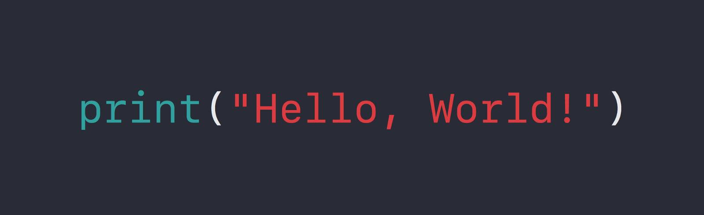

Hello, world!
## My name is Konstantin

- Studying / repeat - c++,c#
- Working on a project -  [тык][social]

Programming languages and my capabilities:

create: scripts (to csgo, and other), cheats, website (functions and img(not nice))

[social]:vk.com
